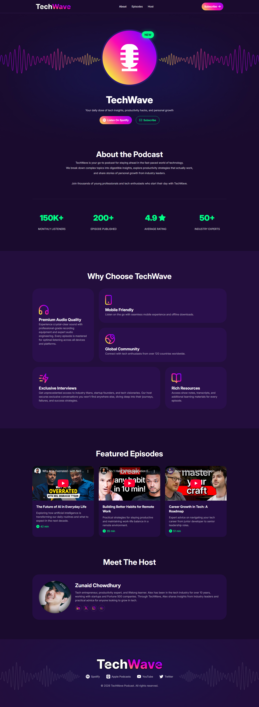
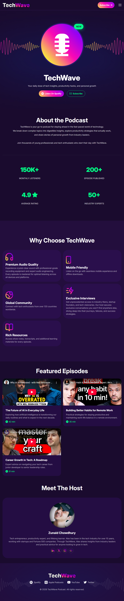
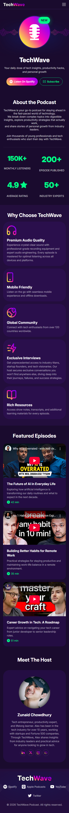

# a02-TechWave
This is an assignment project of MERN stack course in programming hero batch 13.

Live project - https://zunaidchowdhury.github.io/a02-TechWave/

Desktop Version

  

Tablet Version

  

Smaller Screen Version

  

